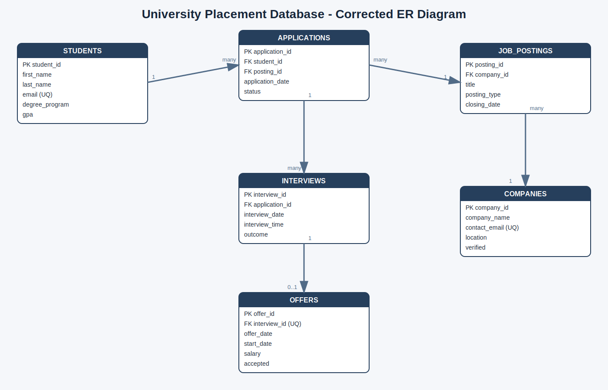
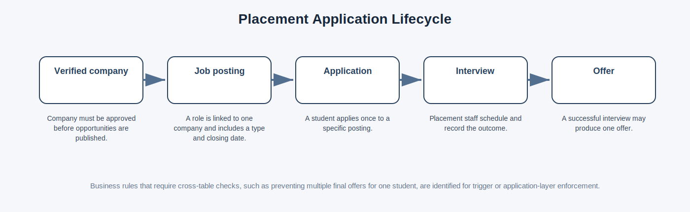
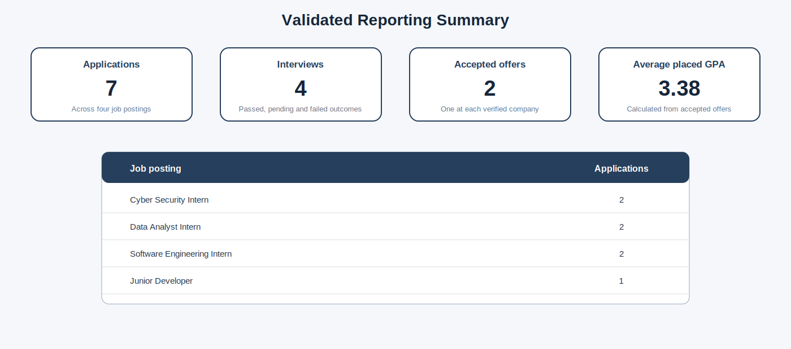

# University Placement Tracking Database

A portfolio reconstruction of a completed Oracle database project for managing university placement activity across students, companies, job postings, applications, interviews and offers.

The project demonstrates relational modelling, Oracle SQL, primary and foreign keys, validation constraints, multi-table reporting queries, a privacy-focused view and structured testing.

> **Evidence note:** Original Oracle APEX screenshots were recovered from the completed coursework. This public version removes account credentials and personal identifiers, corrects the original ER diagram, standardises naming, strengthens constraints and uses synthetic portfolio data. Generated diagrams and reporting assets are explanatory reconstructions rather than direct Oracle APEX captures.

## Project Summary

### Technical explanation

The database separates placement activity into six related tables. `students` and `companies` represent the main participants. `job_postings` belong to companies, `applications` connect students to postings, `interviews` record the next stage of an application, and `offers` store final outcomes. Referential constraints preserve those relationships while reporting queries combine the tables for operational and management use.

### Plain-English explanation

The system records who applied for which role, which company advertised it, whether an interview took place and whether an offer was accepted. Each fact is stored once and linked through IDs so reports can be produced without duplicating the same student, company or job details.



## Main Features

| Feature | Technical explanation | Plain-English explanation |
|---|---|---|
| Relational design | Six normalised tables are linked through primary and foreign keys. | Students, companies, jobs and outcomes are stored separately but remain connected. |
| Data integrity | `NOT NULL`, `UNIQUE`, `CHECK` and foreign-key constraints reject invalid records. | The database blocks duplicate emails, impossible GPA values and unsupported statuses. |
| Duplicate prevention | A composite unique constraint prevents one student applying twice to the same posting. | The same application cannot accidentally be recorded more than once. |
| Reporting queries | Joins, aggregation, filtering and outer joins support placement reporting. | Staff can see applications, interviews, offers and success trends. |
| Privacy-focused view | `vw_applications_summary` excludes email addresses and GPA values. | Staff can see useful summaries without receiving every student detail. |
| Validation harness | An equivalent SQLite test harness checks expected counts and GPA output. | The reporting logic can still be verified after the university APEX workspace was retired. |

## Application Lifecycle



## Reporting Evidence

The portfolio dataset produces seven applications, four interviews, two accepted offers and an average GPA of `3.38` among students who accepted offers.



Expected query outputs are also stored as CSV files in [`outputs/`](outputs/).

## Repository Contents

```text
database-engineering-portfolio/
├── README.md
├── ROADMAP.md
├── assets/
│   ├── diagrams/
│   ├── illustrative-outputs/
│   └── original-evidence/
├── docs/
├── outputs/
├── sql/
└── tests/
```

## SQL Files

- [Schema and constraints](sql/01-schema.sql)
- [Synthetic sample data](sql/02-sample-data.sql)
- [Reporting queries](sql/03-reporting-queries.sql)
- [Privacy-focused summary view](sql/04-summary-view.sql)
- [Constraint test cases](sql/05-constraint-tests.sql)
- [SQL folder guide](sql/README.md)

## Documentation

- [Business rules and requirements](docs/PROJECT-REQUIREMENTS.md)
- [Database design](docs/DATABASE-DESIGN.md)
- [Normalisation](docs/NORMALISATION.md)
- [SQL implementation](docs/SQL-IMPLEMENTATION.md)
- [Queries and reporting](docs/QUERIES-AND-REPORTING.md)
- [Testing and results](docs/TESTING-AND-RESULTS.md)
- [Security considerations](docs/SECURITY-CONSIDERATIONS.md)
- [Reconstruction notes](docs/RECONSTRUCTION-NOTES.md)
- [Full PDF case study](docs/University-Placement-Database-Case-Study.pdf)
- [Roadmap](ROADMAP.md)

## Original Oracle APEX Evidence

Sanitised screenshots from the completed coursework are retained in [`assets/original-evidence/`](assets/original-evidence/). They show successful schema creation, sample-data insertion and query execution. The original ER diagram is preserved only to explain the corrections made in this portfolio version.

## Skills Demonstrated

- Relational database modelling
- Entity relationship design
- Oracle SQL and Oracle APEX
- Primary, foreign and composite keys
- Data validation constraints
- Normalisation to third normal form
- Multi-table joins
- Aggregate queries and reporting
- Database views and data minimisation
- Test design and expected-result validation
- Technical documentation
- Secure public portfolio sanitisation

## Author

**Aakif Ahmed**  
Computer Science undergraduate focused on cybersecurity, AI, automation and secure systems.
